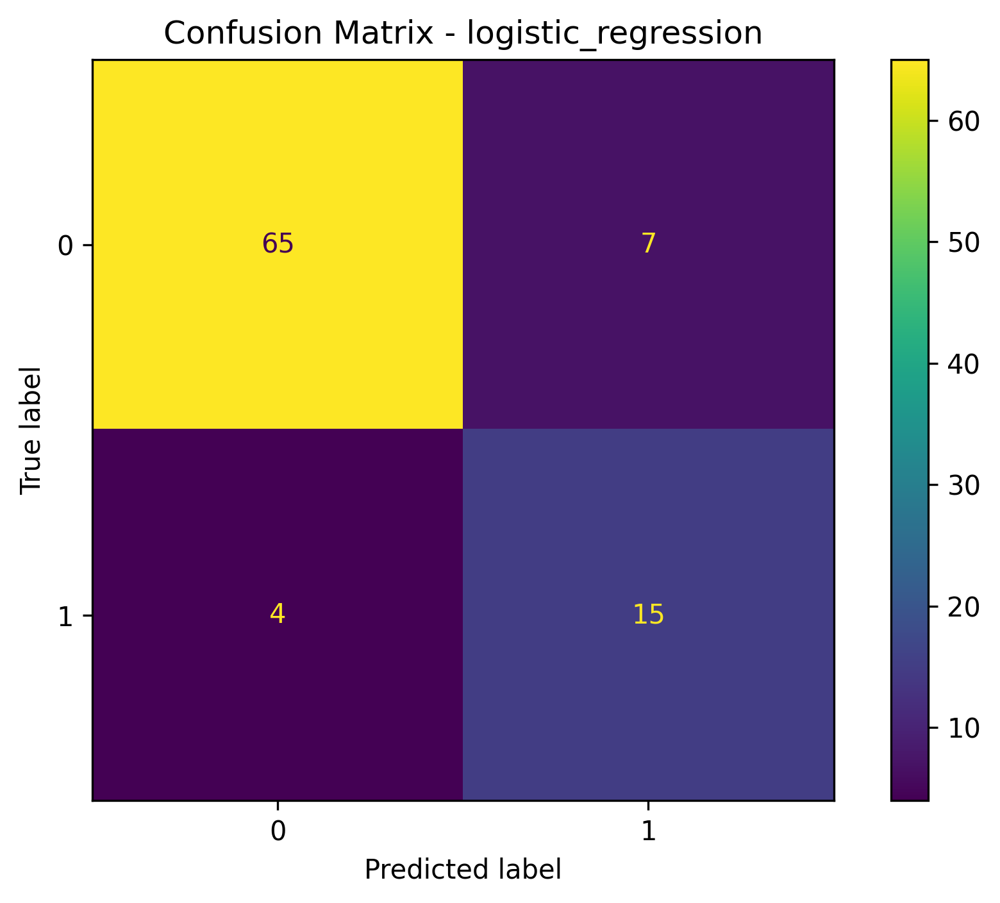
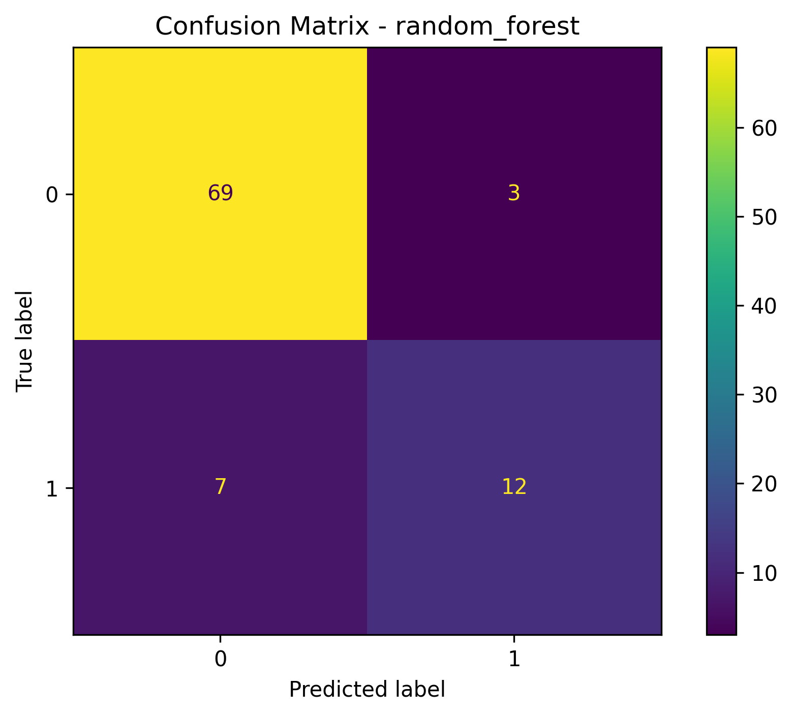
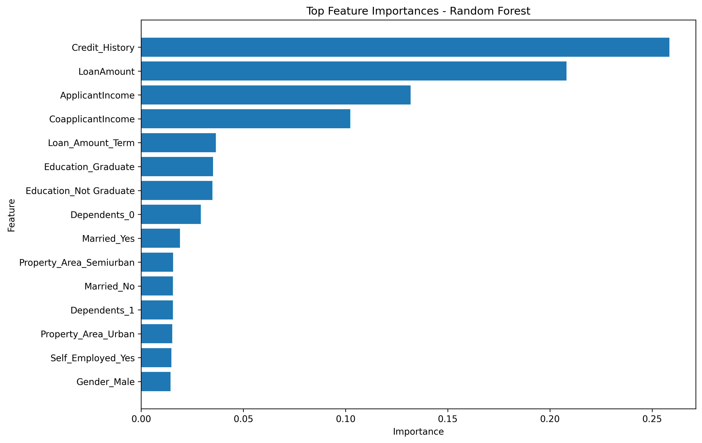
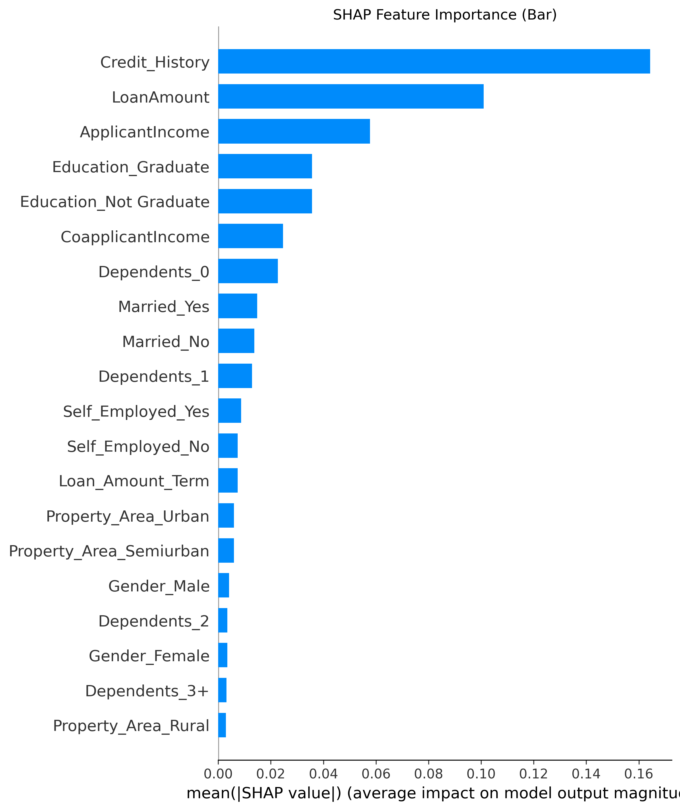
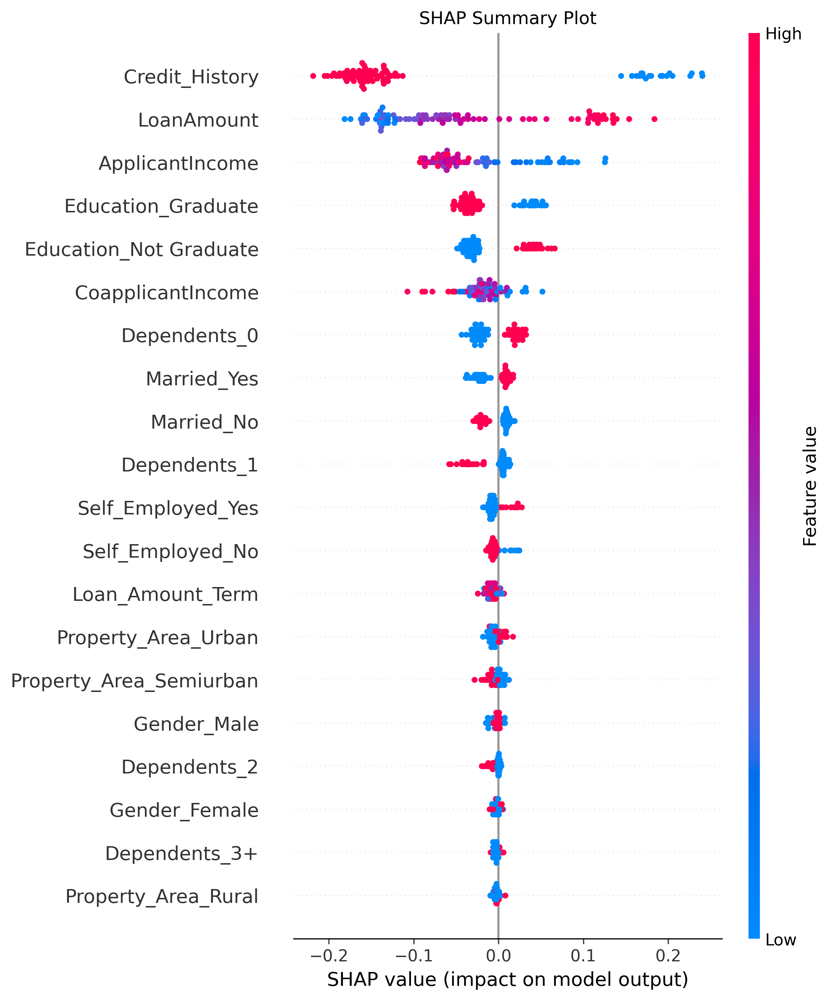
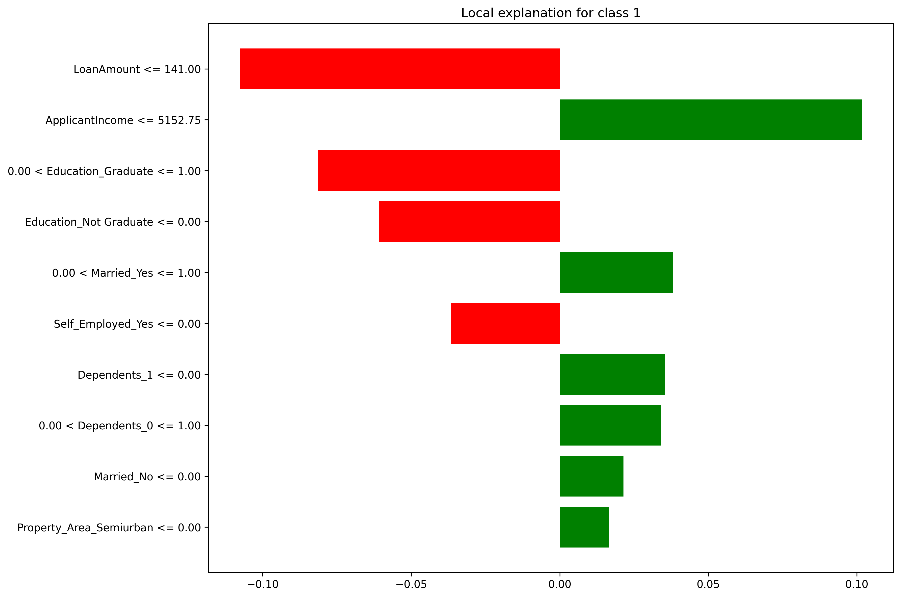

# XAI Loan Approval Prediction Project

This project uses machine learning and Explainable AI techniques to predict loan approval decisions and explain model outputs.

## Project Aim

The aim of this project is to build a loan approval prediction model and improve transparency using Explainable AI methods such as SHAP and LIME.

## Dataset

The project uses a synthetic loan approval dataset with applicant information such as:

- Gender
- Marital status
- Dependents
- Education
- Employment status
- Applicant income
- Coapplicant income
- Loan amount
- Loan amount term
- Credit history
- Property area
- Loan status

## Machine Learning Models

Two machine learning models were developed and compared:

- Logistic Regression
- Random Forest

## Model Evaluation

The models were evaluated using:

- Accuracy
- Precision
- Recall
- F1-score
- Confusion Matrix
- Cross-validation

## Explainable AI Methods

Explainable AI was used to understand the model decisions:

- Random Forest feature importance
- SHAP feature importance bar chart
- SHAP summary plot
- LIME local explanation

## Key Findings

The most important features for loan approval prediction were:

- Credit History
- Loan Amount
- Applicant Income
- Coapplicant Income

The Random Forest model provided stronger predictive performance, while SHAP and LIME helped explain how the model made decisions.

## Results and Visualisations

### Logistic Regression Confusion Matrix

### Random Forest Confusion Matrix

### Random Forest Feature Importance

### SHAP Feature Importance

### SHAP Summary Plot

### LIME Local Explanation

## Project Files

- `xai_project.py` - Main Python source code
- `synthetic_loan_data.csv` - Dataset
- `evaluation_metrics.csv` - Model evaluation results
- `cross_validation_results.csv` - Cross-validation results
- `model_comparison_table.csv` - Model comparison table
- `feature_importance_table.csv` - Feature importance values
- `confusion_matrix_logistic_regression.png` - Logistic Regression confusion matrix
- `confusion_matrix_random_forest.png` - Random Forest confusion matrix
- `feature_importance.png` - Random Forest feature importance graph
- `shap_bar.png` - SHAP feature importance bar chart
- `shap_summary.png` - SHAP summary plot
- `lime_explanation.png` - LIME explanation image
- `lime_explanation.html` - Interactive LIME explanation

## Technologies Used

- Python
- Pandas
- NumPy
- Scikit-learn
- Matplotlib
- SHAP
- LIME
- GitHub

## Conclusion

This project shows how machine learning can support loan approval prediction. It also demonstrates how Explainable AI methods can improve transparency, trust, and understanding of model decisions.
